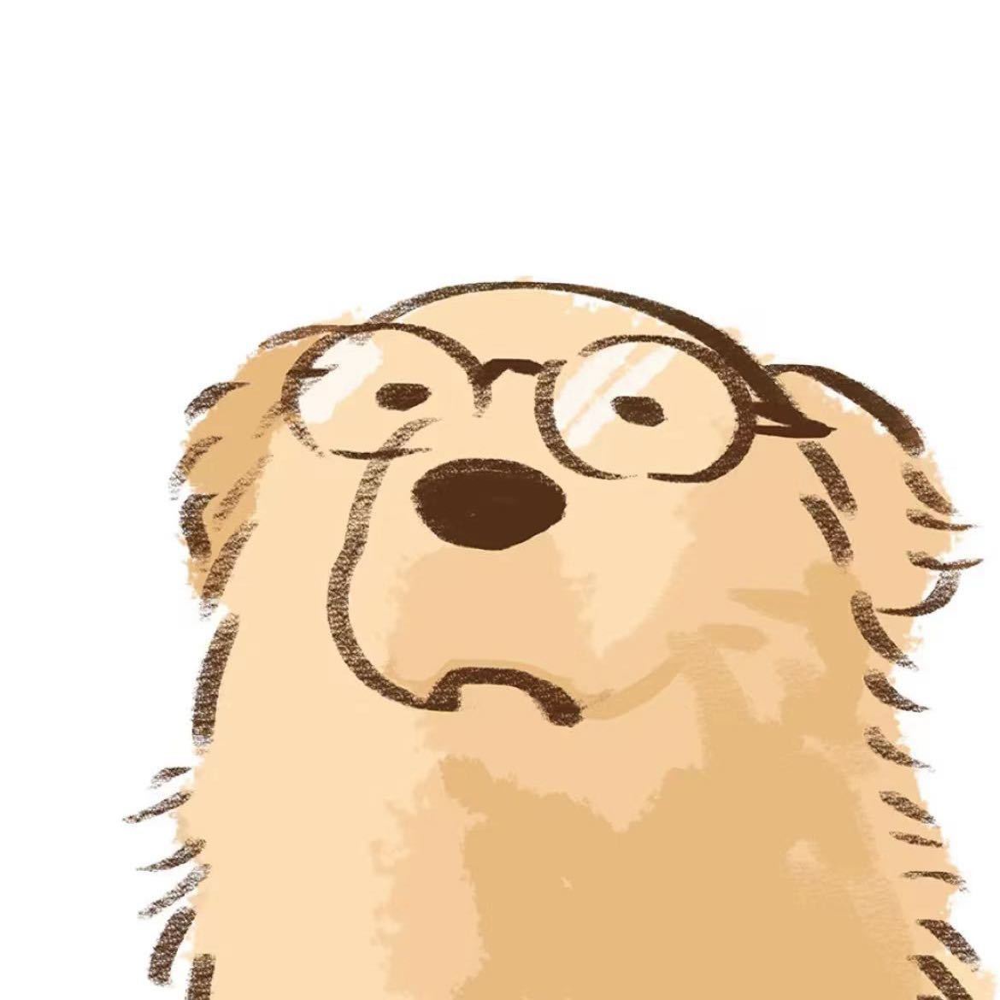
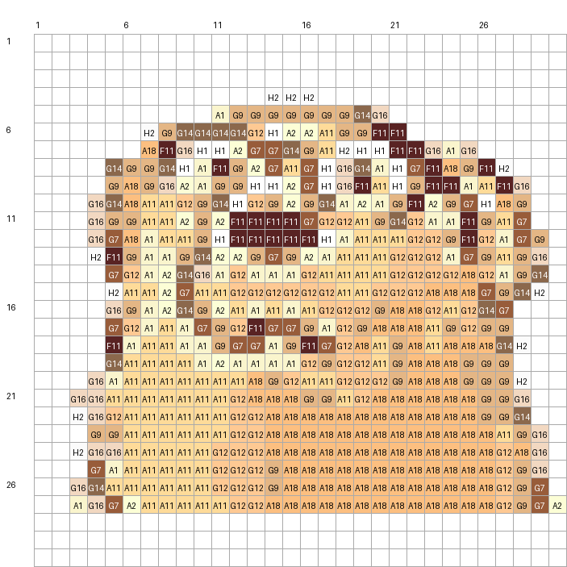
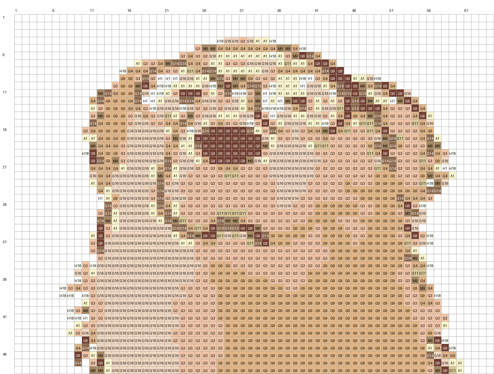

# pindou

A small non-token tool for converting images into fuse-bead（拼豆）patterns.

依赖：Python 3.9+ 与 Pillow。

```bash
python3 -m pip install Pillow
python3 bead_pattern.py input.jpg --size 30 --mode illustration --max-colors 10 --output my_pattern
```

默认读取脚本同目录的 `mard_221_palette.csv`。也可使用包含 `code,name,hex` 三列的其他品牌色卡。

模式：

- `illustration`：插画/卡通，增强轮廓（默认）
- `photo`：照片，保留较自然的明暗
- `pixel`：现成像素图，避免插值模糊

## 参数说明

### 输入与输出

- `image`：必填，输入图片路径，支持 Pillow 能读取的常见格式，如 PNG、JPEG 和 WebP。
- `--output PREFIX`：输出路径前缀，默认是 `bead_pattern`。例如设置为 `result/cat`，会生成 `result/cat_preview.png` 等文件；程序会自动创建不存在的父目录。
- `--palette FILE`：色卡 CSV 路径。默认使用脚本同目录下的 `mard_221_palette.csv`。自定义色卡必须包含 `code`、`name`、`hex` 三列。

### 图纸尺寸

- `--size N`：生成 `N × N` 的正方形图纸，例如 `--size 30`。设置后会同时覆盖 `--width` 和 `--height`，适合常见正方形豆板。
- `--width N`：图纸宽度，单位为豆，默认 `64`。仅在未设置 `--size` 时生效。
- `--height N`：图纸高度，单位为豆，默认 `64`。仅在未设置 `--size` 时生效。
- `--cell N`：带色号图纸中每个格子的显示尺寸，单位为像素，默认 `22`。它只影响 `_chart.png` 的清晰度和文件尺寸，不改变实际豆数或图案内容。色号较长时可适当增大。

### 图像处理

- `--mode {illustration,photo,pixel}`：输入图片类型，默认 `illustration`。
  - `illustration`：适合卡通、线稿和扁平插画；增强对比度并保护眼睛、鼻子和轮廓等深色细节。
  - `photo`：适合照片；使用较温和的锐化和色彩处理，保留自然明暗。
  - `pixel`：适合原本就是像素画的图片；使用最近邻缩放，避免产生模糊的中间色。
- `--max-colors N`：主体的目标颜色数量，默认 `10`。数值越小，备豆越简单、色块越整齐，但会损失渐变和细节；数值越大，还原度通常更高。深色轮廓会被额外保护，因此最终材料表中的实际颜色数可能略高于该值。30×30 图纸建议从 `8`–`12` 开始，64×64 可尝试 `12`–`20`。设为 `0` 可跳过预先减色，但可能产生大量相近色号。
- `--background-threshold N`：近白背景识别阈值，范围建议为 `0`–`255`，默认 `245`。程序从图片边缘开始，将 RGB 三个通道都不低于该值且与边缘相连的区域视为空白。白底不够纯时可降低到 `230`–`240`；浅色主体被误删时应提高阈值。设为 `0` 会关闭自动裁边和背景留空，此时背景也会被转换成豆。
- `--crop-padding R`：自动裁剪后在主体周围保留的边距比例，默认 `0.06`，即约 6%。减小可让主体占满豆板，增大可保留更多留白。它依赖背景识别，因此 `--background-threshold 0` 时不会生效。
- `--cleanup-passes N`：孤立杂色清理次数，默认 `1`。每次会尝试将缺少同色相邻格的浅色孤立点合并到周围主色，同时保留深色五官和轮廓。设为 `0` 保留原始匹配结果；一般不建议超过 `2`，否则小面积有效细节可能被合并。

## 调参示例

原图：



30×30 卡通插画：

```python
python3 bead_pattern.py dog.jpg \
  --size 30 \
  --mode illustration \
  --max-colors 10 \
  --output output/pattern_30
```



64×48 照片，并保留更多颜色：

```bash
python3 bead_pattern.py dog.jpg \
  --width 64 \
  --height 48 \
  --mode photo \
  --max-colors 18 \
  --cleanup-passes 1 \
  --output output/photo_64x48
```



保留原图背景：

```bash
python3 bead_pattern.py input.png \
  --size 30 \
  --background-threshold 0 \
  --output output/with_background
```

## 输出文件

- `_preview.png`：最近邻放大的无网格预览图。
- `_chart.png`：带网格、坐标和 MARD 色号的拼豆图纸。
- `_matrix.csv`：逐行逐列记录每个位置的色号；空白单元格表示不放豆。
- `_materials.csv`：所需色号、颜色、HEX 参考色和数量统计。

例如 `--output output/cat` 会生成 `output/cat_preview.png`、`output/cat_chart.png`、`output/cat_matrix.csv` 和 `output/cat_materials.csv`。

屏幕 HEX 色值与实体豆可能因色卡来源、显示器及生产批次产生色差。重要作品建议先与手中的实体色卡核对。

Maintainer: yf_pumc#163.com
